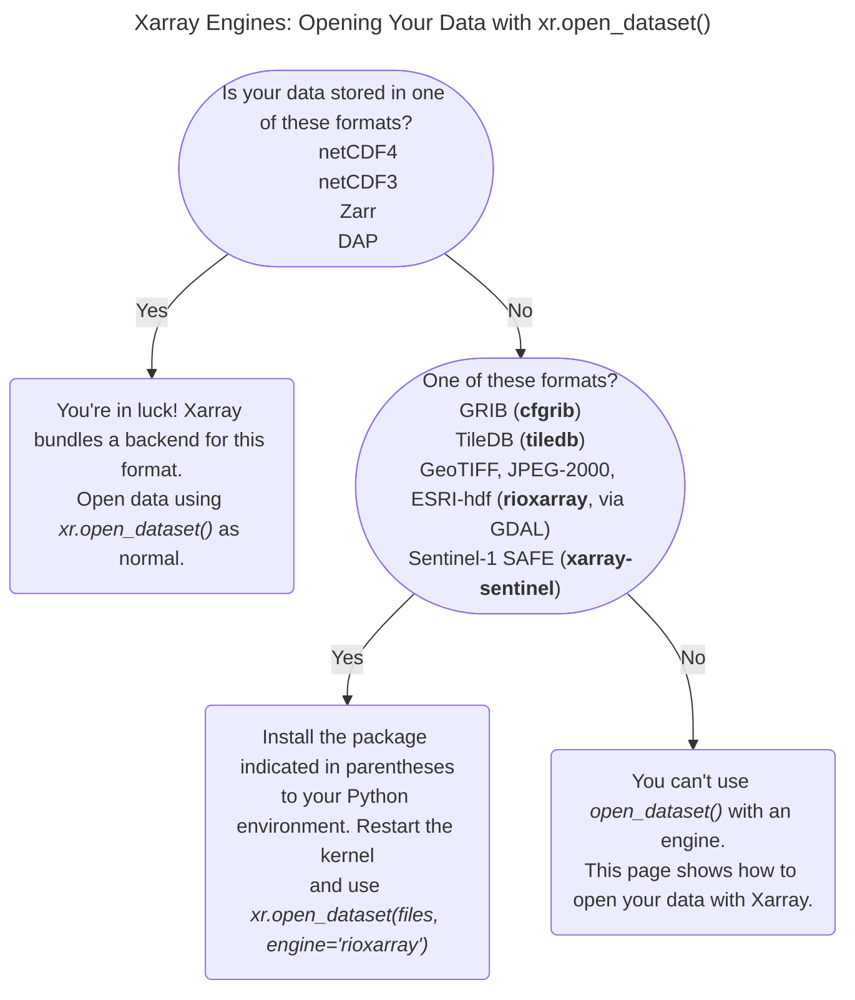

# Creating new backends

## Introduction



You can [read different type of files](https://docs.xarray.dev/en/stable/user-guide/io.html) in `xr.open_dataset` by specifying the engine to be used:

```python
import xarray as xr
xr.open_dataset("my_file.grib" , engine="cfgrib")
```

For each available engine there is an underlying backend, that reads the data and pack them in a dataset.

Xarray bundles several backends internally for the following formats:

- netcdf4 - netCDF4
- scipy - netCDF3
- zarr - Zarr
- pydap - DAP
- ...

External Backends that use the new backend API (xarray >= v0.18.0) that allows to add support for backend without any change to Xarray

- [cfgrib](https://github.com/ecmwf/cfgrib) - GRIB
- [tiledb](https://github.com/TileDB-Inc/TileDB-CF-Py) - TileDB
- [rioxarray](https://corteva.github.io/rioxarray/stable/) - GeoTIFF, JPEG-2000, ESRI-hdr, etc (via GDAL)
- [xarray-sentinel](https://github.com/bopen/xarray-sentinel) - Sentinel-1 SAFE
- ...

## Why using the Xarray backend API

- Your users don't need to learn a new interface that is they can use `xr.open_dataset` with `engine` kwarg.
- With little extra effort you can have lazy loading with Dask. you have to implement a function for reading blocks and Xarray will manage lazy loading with Dask for you
- It's easy to implement: you don't need to integrate any code in Xarray

## Next

See the [documentation](https://docs.xarray.dev/en/stable/internals/how-to-add-new-backend.html) for more.

Follow the tutorial on creating a new backend for binary files.

```{tableofcontents}

```
